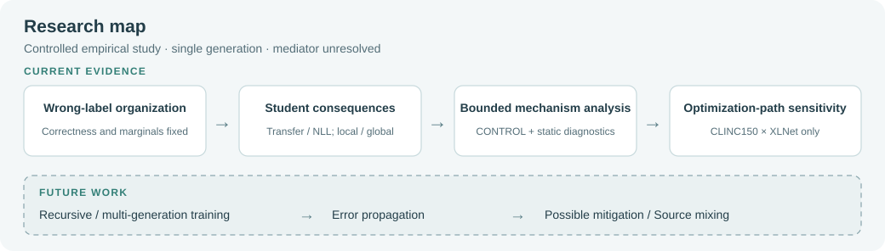

# Multi-Source Supervision Dynamics

Controlled studies of how erroneous multi-source supervision is organized, transferred, and propagated through learning systems.

[中文说明](README_zh.md) · [Current study](studies/mlbd2026_wrong_label_organization/README.md) · [Evidence routes](docs/EVIDENCE_ROUTES.md) · [Reproduction](docs/REPRODUCIBILITY.md)

**Current study:** *Wrong-Label Organization in Multi-Source Supervision: Controlled Effects and Optimization-Path Sensitivity*.
This is a controlled empirical study. Current evidence is **single-generation**; propagation across generations is future work.


Main experiments, concentration-matched controls, static diagnostics and the controlled optimization-path experiment are complete. The manuscript is under author review (author-reported status); no acceptance or publication is claimed. **Clean end-to-end training reproduction is not yet packaged.**

**Finding:** Wrong-label organization can change Student behavior under the tested controls. The effects are conditional, the path mediator is unresolved, and recursive propagation has not been tested.

## Start Here

| Goal | Recommended entrypoints |
| --- | --- |
| Understand the research question | Research Question below → [terminology and endpoints](docs/TERMINOLOGY.md) |
| Inspect current results | Results Snapshot below → [study results](studies/mlbd2026_wrong_label_organization/README.md) |
| Reproduce target construction | [construction route and missing inputs](docs/REPRODUCIBILITY.md#target-construction) → [implementation map](studies/mlbd2026_wrong_label_organization/scripts/reference/README.md) |
| Reproduce Student comparisons | [reproduction status](docs/REPRODUCIBILITY.md#student-comparisons) → [frozen configs](studies/mlbd2026_wrong_label_organization/configs/README.md) |
| Inspect mechanism diagnostics | [diagnostic evidence route](docs/EVIDENCE_ROUTES.md#mechanism-diagnostics) |
| Understand claim boundaries | [limitations](docs/KNOWN_LIMITATIONS.md) → [chronology](docs/EXPERIMENTAL_CHRONOLOGY.md) |
| Follow future recursive work | [roadmap](docs/ROADMAP.md) → [recursive scope](studies/recursive_training/README.md) |

Suggested reading: overview → study → evidence routes → limitations. For technical review, start with the evidence manifest and verifier before reading historical implementation snapshots.

## Research Question

Holding Source correctness and key marginal statistics fixed, does changing which wrong label is assigned to which input alter downstream Student behavior? Three Sources supply hard labels; a Student learns from their equally weighted aggregate soft targets. Source identity is retained for auditing, not supplied as a separate Student input.

## What Changes / What Stays Fixed

| Quantity | R1 / R2 | Concentration-matched CONTROL |
| --- | --- | --- |
| Input IDs and text; truth labels | Preserved | Preserved |
| Source count and equal weights | Preserved | Preserved |
| Per-example, per-Source correctness; correct cells | Preserved | Preserved |
| True-label target mass, q(true) | Preserved | Preserved |
| Source × truth wrong-label marginals | Preserved | Preserved |
| Wrong-label identity ↔ input assignment | Changed | Changed |
| Each row's sorted raw-target probabilities | Not constrained | Preserved |
| Support size, entropy, sum(q²), same-wrong total | Not constrained | Preserved; consequences of the above constraints |

R1/R2 reorganize wrong labels within each Source × truth group. CONTROL moves **whole ordered Source-label triples** between matched rows. It tests whether concentration alone suffices to explain the observed contrasts; it cannot establish that smoothness is irrelevant or that identity is the unique mechanism. [Definitions and validators](docs/EVIDENCE_ROUTES.md#construction-and-invariants).

## At a Glance

| Scope | Verified study design |
| --- | --- |
| Datasets | CLINC150; BANKING77 |
| Sources | BERT-base-uncased; RoBERTa-base; DeBERTa-v3-small |
| Students | RoBERTa-base; XLNet-base-cased |
| Main formal fits | 48 = 2 datasets × 2 Students × 4 seeds × REAL/R1/R2 |
| Concentration control | Four dataset/Student settings; one frozen realization per dataset |
| Controlled path experiment | 16 fresh fits: CLINC150 × XLNet × REAL/CONTROL × original/reversed presentation × 4 seeds |
| Student seeds, in order | 167174636, 1852328752, 1231418446, 1461753708 |
| Evaluation | Secondary, LocalNLL, Primary, Complement |
| Frozen local / official test sizes | CLINC150: 129 / 4,500; BANKING77: 304 / 3,080 |

Counts exclude discovery and adequacy runs. R1 and R2 reuse REAL fits; they are not eight independent seed replications. [Evidence bindings](studies/mlbd2026_wrong_label_organization/manifests/evidence_manifest.json).

## Main Findings

- Controlled wrong-label organization can alter downstream Student behavior.
- Specific shared-wrong transfer and true-label degradation can dissociate. Local degradation does not establish robust global degradation.
- Concentration-matched contrasts weaken a smoothness-only explanation in three settings, with a non-unanimous CLINC150 × XLNet result.
- The tested static diagnostics provide no unified mechanism explanation.
- The CLINC150 × XLNet intervention supports setting-level optimization-path sensitivity. The mediator remains unidentified.

These [bounded findings](docs/EVIDENCE_ROUTES.md) do not validate mitigation, recursive collapse, a unique mechanism, or the claim that lower correlation is always better.

## Study Map



## Reproduction

From the repository root, with Python 3.10 or newer:

```bash
python scripts/verify_package.py
python scripts/show_frozen_table.py --table main
python scripts/show_frozen_table.py --table control
python scripts/show_frozen_table.py --table path
```

The verifier reads files and checks hashes and identities without importing historical training code. The table viewer prints frozen CSV values; it does not compute new scientific results. These commands need no GPU, downloads or third-party Python dependencies.

Construction and training implementations are available for inspection, with external dependencies explicitly identified as unbundled. Do not run historical builders against canonical artifacts. See [supported stages and gaps](docs/REPRODUCIBILITY.md).

## Results Snapshot

All ordinary contrasts are **REAL − comparator**. Secondary is probability on the frozen shared-wrong label; NLL is in nats. Positive NLL means worse true-label scoring under REAL.

| Descriptive observation | Frozen evidence |
| --- | --- |
| CLINC150 × XLNet, R1: Secondary +0.029098; LocalNLL −0.024081 | [Main table](studies/mlbd2026_wrong_label_organization/results/TABLE_1_DATA.csv): transfer and true-label harm need not agree |
| CONTROL: both local endpoints positive across all four seeds in 3/4 settings | [Control table](studies/mlbd2026_wrong_label_organization/results/CONTROL_TABLE_DATA.csv): the fourth setting remains visible |
| Path interaction: LocalNLL `++++`; Secondary `+-++` | [All-seed path table](studies/mlbd2026_wrong_label_organization/results/M3_RESULT_TABLE_DATA.csv) and [summaries](studies/mlbd2026_wrong_label_organization/results/M3_SUMMARY_DATA.csv) |

The path experiment retains seed **1852328752**, whose large response strongly affects the mean and Secondary direction. Four seeds provide limited precision; signs are descriptive, not significance tests. No setting-level pooling is used.

## Repository Structure

```text
docs/                         Navigation, limitations, chronology, local SVGs
scripts/                      Read-only verifier and frozen-table viewer
studies/
  mlbd2026_wrong_label_organization/
    configs/                  Frozen contracts; explicit redaction records
    evidence/                 Seed values, invariant receipts, diagnostics
    figures/                  Standalone Figure 1 source
    manifests/                Source/package SHA256 and transformation ledger
    results/                  Frozen table and figure data
    scripts/reference/        Historical implementations for inspection
  recursive_training/         Future scope only
tests/                        Package-verifier regression checks
```

Shared `src/` modules will be introduced when backed by a portable implementation. Original scientific files have not been moved to fit a proposed tree.

## Reproducibility and Evidence

Follow [evidence routes](docs/EVIDENCE_ROUTES.md) from each result to its seed-level artifact, construction/config authority and implementation. The [manifest](studies/mlbd2026_wrong_label_organization/manifests/evidence_manifest.json) records source locations and SHA256 values. Imports came from an uncommitted research workspace; its Git HEAD alone does not identify their content.

Result CSVs are byte-identical copies. Three JSON records have machine-location redactions recorded by selector. Embedded historical paths are provenance locators, not promises that all original assets are included. [Packaging details](docs/PACKAGING.md).

## Limitations and Scope

This is a single-generation study, not a new algorithm. The full matrix was not preregistered from the outset. Dataset comparisons also change Source panels, label spaces and subsets. Static analyses are exploratory; the path intervention jointly changes presentation, learning-rate exposure and random-stream assignment. It does not isolate optimizer, dropout or batch-order mediation. [Known limitations](docs/KNOWN_LIMITATIONS.md).

## Roadmap

Current controlled study → separately designed recursive experiments → error propagation analysis → possible mitigation/source mixing, conditional on evidence. Later stages are **future work**. [Roadmap](docs/ROADMAP.md).

## Citation / Rights / Third-Party

No final citation metadata, DOI, acceptance status or author identities are supplied. `CITATION.cff` is deferred until verified public metadata exist. Public visibility does not grant a blanket license. Read [Rights Notice](RIGHTS_NOTICE.md) and [Third-Party Notices](THIRD_PARTY_NOTICES.md). Manuscripts, Overleaf projects, datasets and weights are not bundled.

The [history and naming record](docs/HISTORY_AND_NAMING.md) identifies the archived July 2026 planning state and explains this repository's long-term scope.
