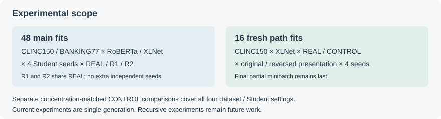

<div align="center">

# 多来源监督动态研究

**研究多来源错误监督如何组织、影响 Student，以及未来可能如何跨代传播。**

<p><a href="README.md">English</a> · <a href="studies/mlbd2026_wrong_label_organization/README.md">当前研究</a> · <a href="docs/EVIDENCE_ROUTES.md">证据路线</a> · <a href="docs/REPRODUCIBILITY.md">复现说明</a> · <a href="docs/KNOWN_LIMITATIONS.md">研究限制</a></p>

</div>

## 研究状态

<p align="center">
  
</p>

主实验、concentration-matched CONTROL、静态诊断及受控 optimization-path 实验已经完成；论文处于作者审阅阶段。**当前证据只覆盖单代研究**，不声称已经验证递归传播。

## 研究快照

| 当前范围 | 主实验 | 路径干预 | 后续扩展 |
| --- | --- | --- | --- |
| 单代研究 | 48 次正式拟合 | 16 次全新拟合 | 递归训练 · 未来工作 |

**当前发现：** 在已测试控制条件下，错误标签的组织方式可以改变 Student 行为；影响取决于具体设置，路径中介尚未识别，递归传播尚未测试。

## 当前研究

*Wrong-Label Organization in Multi-Source Supervision: Controlled Effects and Optimization-Path Sensitivity* 是 **controlled empirical study**，不是新算法论文。[研究说明](studies/mlbd2026_wrong_label_organization/README.md)。

## 从这里开始

| 目的 | 入口 |
| --- | --- |
| 理解问题与术语 | [英文首页](README.md)、[术语](docs/TERMINOLOGY.md) |
| 检查结果和每个数字来源 | [研究说明](studies/mlbd2026_wrong_label_organization/README.md)、[证据路线](docs/EVIDENCE_ROUTES.md) |
| 检查构造、seed、invariant | [配置说明](studies/mlbd2026_wrong_label_organization/configs/README.md)、[实现索引](studies/mlbd2026_wrong_label_organization/scripts/reference/README.md) |
| 复现与可用性 | [复现说明](docs/REPRODUCIBILITY.md) |
| 判断结论边界 | [限制](docs/KNOWN_LIMITATIONS.md)、[时间线](docs/EXPERIMENTAL_CHRONOLOGY.md) |
| 跟踪后续工作 | [路线图](docs/ROADMAP.md) |

## 核心问题

固定 Source 的逐样本对错、真标签 target mass 和 Source × truth 错误标签边际，只改变“哪个错误标签分配给哪个 input”，Student 行为是否仍会改变？

## 研究路线

<p align="center">
  
</p>

## 受控设计

R1/R2 不移动 input、truth 或 correct cells，在各 Source × truth 组内重排错误标签。CONTROL 在匹配行间移动完整、有序的三个 Source 标签，额外保持每行排序后的 raw-target 概率；support、entropy、sum(q²) 和 same-wrong 总量也由 CONTROL 构造保持。这不能理解为多个独立机制都已被隔离。[构造与不变量](docs/EVIDENCE_ROUTES.md#construction-and-invariants)。

## 实验范围

<p align="center">
  
</p>

- CLINC150、BANKING77；Sources 为 BERT-base、RoBERTa-base、DeBERTa-v3-small；Students 为 RoBERTa-base、XLNet-base-cased。
- 主实验：2 × 2 × 4 seeds × REAL/R1/R2 = **48 formal fits**。R1/R2 共用 REAL，不是八个独立 seed 重复。
- Path：CLINC150 × XLNet，REAL/CONTROL × 原顺序/反转完整 minibatch 顺序 × 4 seeds = **16 fresh fits**；末尾不完整 batch 保持最后。
- 固定 seed 顺序：167174636、1852328752、1231418446、1461753708。

## 主要发现

- wrong-label organization 可以改变 Student；shared-wrong transfer 与 true-label degradation 可解耦；局部退化不等于稳定的全局退化。
- CONTROL 在三格削弱 smoothness-only explanation，CLINC150 × XLNet 为非一致结果。不能说 smoothness 无关或 identity 是唯一机制。
- 静态诊断未给出统一机制。Path 实验 LocalNLL interaction 为 `++++`，Secondary 为 `+-++`，支持该 setting 的路径敏感性；中介未识别。

## 结果快照

| 观察 | 证据入口 |
| --- | --- |
| shared-wrong transfer 与 true-label degradation 可解耦 | [主实验冻结表](studies/mlbd2026_wrong_label_organization/results/TABLE_1_DATA.csv) |
| CONTROL 三格削弱 smoothness-only explanation；第四格非一致 | [对照冻结表](studies/mlbd2026_wrong_label_organization/results/CONTROL_TABLE_DATA.csv) |
| 路径干预的 LocalNLL interaction 为 `++++`、Secondary 为 `+-++` | [逐 seed 表](studies/mlbd2026_wrong_label_organization/results/M3_RESULT_TABLE_DATA.csv)与[汇总](studies/mlbd2026_wrong_label_organization/results/M3_SUMMARY_DATA.csv) |

差值为 REAL − comparator。Secondary 单位是概率，NLL 是 nats；正 NLL 表示 REAL 更差。Path 实验中 seed 1852328752 的大响应完整保留，没有删掉来美化结论。

## 复现范围

仓库根目录，Python 3.10+：

```bash
python scripts/verify_package.py
python scripts/show_frozen_table.py --table main
python scripts/show_frozen_table.py --table control
python scripts/show_frozen_table.py --table path
```

这些命令只验证文件或显示冻结数值，不训练、不推理、不下载、不重新计算科学结果。历史构造与训练实现可供审阅，但依赖未打包资产和历史布局；**本版不声称 clean end-to-end training reproduction 已就绪**。不要直接执行历史 builder 覆盖正式目录。

## 范围与限制

完整 2×2 矩阵不是最初一次性预注册；部分扩展在先前结果曝光后冻结。四个 seed 精度有限；两个重排 realization 不代表 realization 分布；跨数据集比较同时改变 Source 等因素。不能宣称低相关总是更好、recursive collapse 已证明、mitigation 已验证或优化路径是唯一机制。[详细限制](docs/KNOWN_LIMITATIONS.md)。

## 后续路线

当前单代研究 → 单独设计的递归实验 → 错误传播分析 → 视证据考虑 mitigation / Source mixing。后续阶段均为**未来工作**。[路线图](docs/ROADMAP.md)。

## 权利与引用

没有新增统一开源许可证。第三方数据和模型保持原权利；见 [Rights Notice](RIGHTS_NOTICE.md)、[Third-Party Notices](THIRD_PARTY_NOTICES.md)。论文正文、PDF、Overleaf、权重、原始数据与私人记录不在公开包中。正式引用信息待确认后提供。
